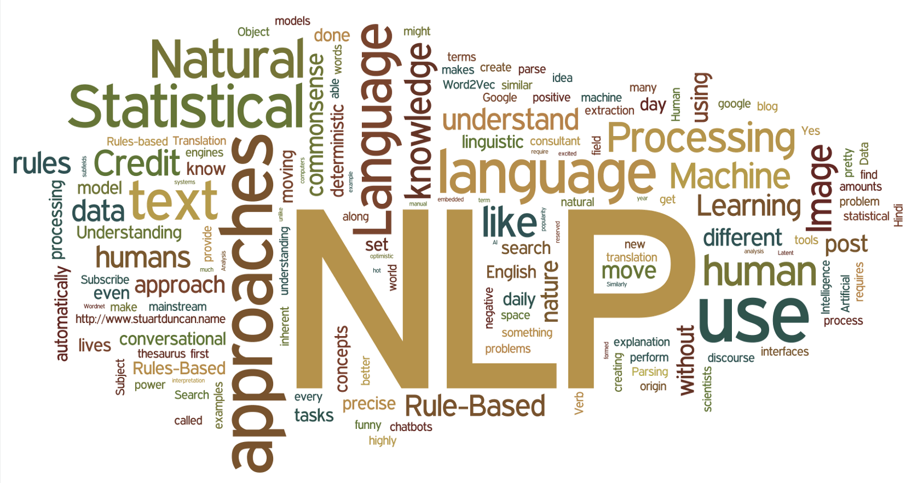
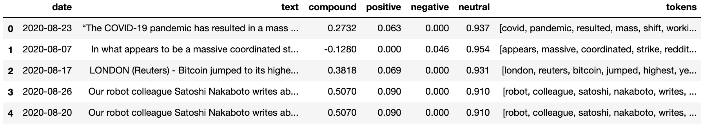
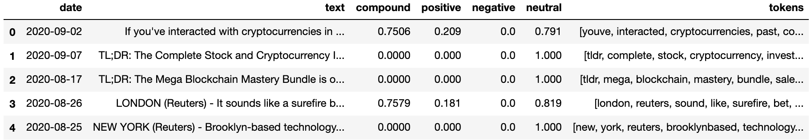
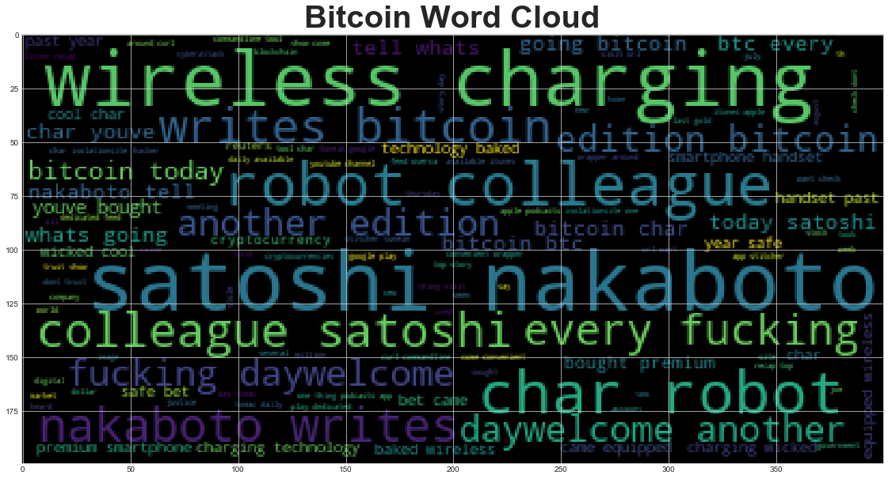
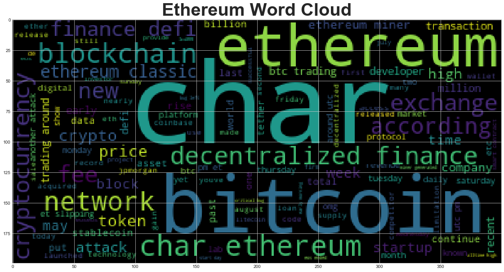
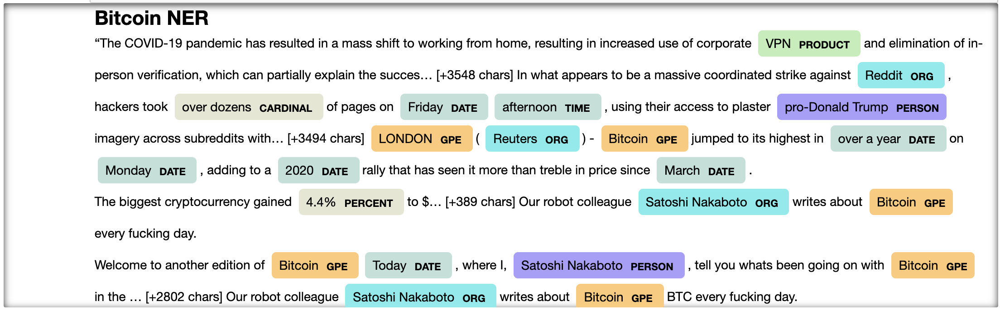
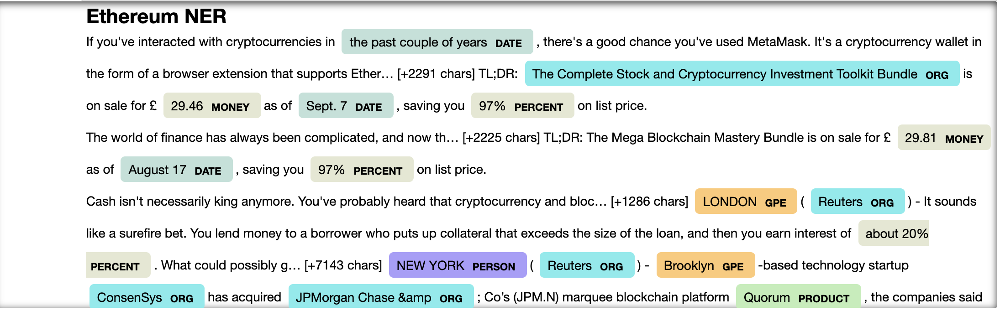

# Assignnent 12: Tales from the Crypto 

## Report Summary

This assignment covers the following tasks in the cryptocurrency domain:

1. [Sentiment Analysis](#1---Sentiment-Analysis)
2. [Natural Language Processing](#2---Natural-Language-Processing)
3. [Named Entity Recognition](#3---Named-Entity-Recognition)

---

## Files

[Starter Notebook](Starter_Code/crypto_sentiment.ipynb)

---

## Breakdown

---

### 1 - Sentiment Analysis

In this section, the news api is used to pull the latest news articles for bitcoin and ethereum. A function that calculates the sentiment scores for 
a list of articles is implemented and used to calculate sentiment scores (i.e. positive, negative, neural, coumpound) for each coin. 

 

> Q: Which coin had the highest mean positive score?  
> A: Bitcoin had the highest mean positive score. While Ethereum had the mean positive score 0.069688, Bitcoin had the mean positive score 0.083629. 
> Q: Which coin had the highest negative score? 
> A: Ethereum coin had the highest compound score. Bitcoin had the max compound score 0.7964, while Ethereum had the max compound score 0.8519. 
> Q: Which coin had the highest positive score? 
> A: Ethereum coin had the highest positive score. Bitcoin had the max positive score 0.21, while Ethereum had the max positive score 0.311. 

 

---

### 2 - Natural Language Processing

In this section,  NLTK is used to tokenize text, find n-gram counts, and create word clouds for both coins.  

---

__Tokenization__:

Upon tokenization, a list of tokens associated with an article in included in the dataframe for each coin.

1. Here are top 5 rows from bitcoin dataframe:

1. Here are top 5 rows from ethereum dataframe:

  

__Frequency Analysis Result__:

1. Here are the top 10 words found out of articles for Bitcoin:

`{('satoshi', 'nakaboto'): 38, ('wireless', 'charging'): 32, ('char', 'robot'): 19, ('robot', 'colleague'): 19, ('colleague', 'satoshi'): 19, ('nakaboto', 'writes'): 19, ('writes', 'bitcoin'): 19, ('every', 'fucking'): 19, ('fucking', 'daywelcome'): 19, ('daywelcome', 'another'): 19}`  

2. Here are the top 10 words found out of articles for Ethereum:

`{('char', 'ethereum'): 18, ('decentralized', 'finance'): 13, ('finance', 'defi'): 11, ('ethereum', 'classic'): 11, ('ethereum', 'miner'): 7, ('btc', 'trading'): 6, ('trading', 'around'): 6, ('ethereum', 'blockchain'): 6, ('char', 'price'): 4, ('price', 'bitcoin'): 4}`  

 

__Word Cloud Result__:

1. For Bitcoin:  

2. For Ethereum:  

---

### 3 - Named Entity Recognition

In this section, a named entity recognition model is built for both coins is visualized using SpaCy. In addition, all entities from all of the text are displayed as well, for each coin.  

1. Screenshot of NER visualization for Bitcoin text  

2. Screenshot of NER visualization for Ethereum text  

---