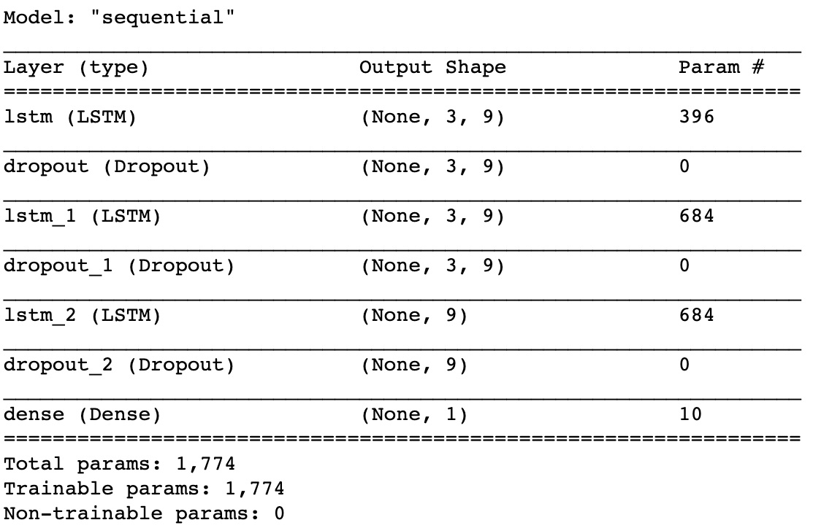
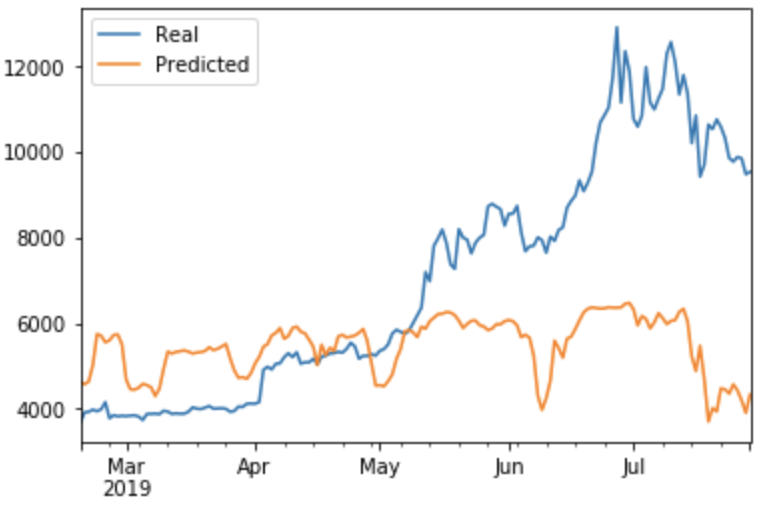
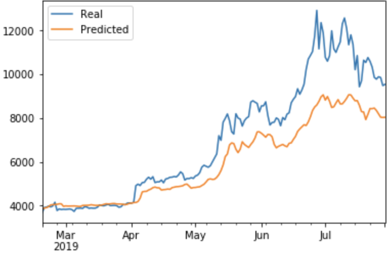

# Assignnent 14: LSTM Stock Predictor in Deep Learning 

  

## Report Summary

This assignment covers the following tasks:

1. [RNN prediction on Closing Price with FNG values](#1---RNN-Prediction-on-Closing-Price-with-FNG-values)
2. [RNN Prediction on Closing Price with Closing values](#2---RNN-Prediction-on-Closing-Price-with-Closing-values)
3. [Answers on Performance Evaluation Questions](#3---Answers-on-Performance-Evaluation-Questions)

---

## Files

[Task 1 Starter Notebook](Instructions/Starter_Code/lstm_stock_predictor_fng.ipynb)  
[Task 2 Starter Notebook](Instructions/Starter_Code/lstm_stock_predictor_closing.ipynb)  

---

## Breakdown

---

### 1 - RNN Prediction on Closing Price with FNG values

In this section, a custom LSTM RNN was designed and built. The LSTM RNN model uses a 10 day window of Bitcoin fear and greed index values to predict the 11th day closing price.

The steps invovled during the process are the following:  

(1). Read both btc_sentiment.csv and btc_historic.csv as two dataframes and combine them into one using `join()`  
(2). Use the `window_data(df, window, feature_col_number, target_col_number)` to generate the X and y values for the model.  
(3). Split the data into 70% training and 30% testing  
(4). Apply the MinMaxScaler to the X and y values to standardize input data for RNN processing  
(5). Reshape the X_train and X_test data for the model using `reshape((X_train.shape[0], X_train.shape[1], 1))`  
(6). Build and train a custom LSTM RNN  
    
&nbsp;&nbsp;&nbsp;&nbsp;- The RNN model has 3 LSTM layers followed by dropout layers  
&nbsp;&nbsp;&nbsp;&nbsp;- The number of neurons in the hidden layers = 9, window size = 3  
&nbsp;&nbsp;&nbsp;&nbsp;- The dropout fraction is 0.2  
&nbsp;&nbsp;&nbsp;&nbsp;- Model Summary:  
  
(7). Evaluate the model using the X_test and y_test data.  
(8). Use the X_test data to make predictions  
(9). Plot the Real vs predicted values as a line chart:  
  

 

---

### 2 - RNN Prediction on Closing Price with Closing values

In this section, a custom LSTM RNN was designed and built. The LSTM RNN model uses a 10 day window of Bitcoin closing prices to predict the 11th day closing price.

The steps invovled during the process are the following:  

(1). Read both btc_sentiment.csv and btc_historic.csv as two dataframes and combine them into one using `join()`  
(2). Use the `window_data(df, window, feature_col_number, target_col_number)` to generate the X and y values for the model.  
(3). Split the data into 70% training and 30% testing  
(4). Apply the MinMaxScaler to the X and y values to standardize input data for RNN processing  
(5). Reshape the X_train and X_test data for the model using `reshape((X_train.shape[0], X_train.shape[1], 1))`  
(6). Build and train a custom LSTM RNN  
&nbsp;&nbsp;&nbsp;&nbsp;- The RNN model has 3 LSTM layers followed by dropout layers  
&nbsp;&nbsp;&nbsp;&nbsp;- The number of neurons in the hidden layers = 9, window size = 3  
&nbsp;&nbsp;&nbsp;&nbsp;- The dropout fraction is 0.2  
&nbsp;&nbsp;&nbsp;&nbsp;- Model Summary:  
  
(7). Evaluate the model using the X_test and y_test data.  
(8). Use the X_test data to make predictions  
(9). Plot the Real vs predicted values as a line chart:  
  

---

### 3 - Answers on Performance Evaluation Questions

This section answers questions listed in README.md  

>__Q__: Which model has a lower loss?  
>__A__: LSTM model with closing price feature has a lower loss, which is 0.0245, whereas the loss of LSTM model with fng feature is 0.1063.  
>__Q__: Which model tracks the actual values better over time?  
>__A__: LSTM model with closing price feature performs better than the one with fng value in terms of value tracking. 
This can be seen from the line charts provided for both models.  
>__Q__: Which window size works best for the model?  
>__A__: window size = 3 and unit size = 9 tends to work best. Experiementation shown that the bigger the window size, the poorer the model performance. 
For instance, if window size = 20 and unit size = 40, the predicted closing prices tend to be consistent (i.e. flat line). 