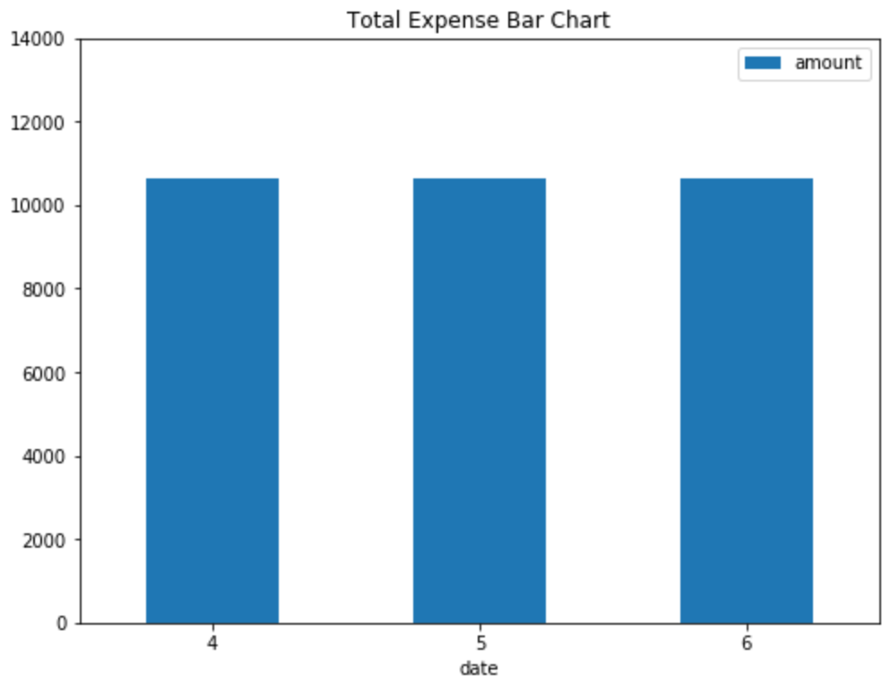

# Financial Report

The report includes the summary of the budget analysis and the retirement planning.

## Budget Analysis

### Average Monthly Expense 

The average total monthly expense is $10645.24, and in fact the monthly expense is the same from April to June:

### Spending Categories

Regarding the spending categories, the monthly budget is primarily allocated for Transfer, Payment and Food & Drink:

## Retirement Plan

### Expected Cumulative Returns

After 30 years, the expected cumulative returns (ECR) for the  10th ,50th and 90th percentiles can be estimated as follows:

| 10th Percentile-ECR | 50th Percentile-ECR | 90th Percentile-ECR 
| ------------------- | ------------------- | -------------------
| 102.83 | 199.08 | 379.34        

### Expected Returns ($) for initial Investment of $20000 

| 10th Percentile-ER | 50th Percentile-ER | 90th Percentile-ER |
| ------------------ | ------------------ | ----------------- |
| 2076512.13 | 4001677.14 | 7606836.15 |        

### Estimated Judgement

Given the current projected annual income from the Plaid analysis, a 4% withdraw rate from the retirement portfolio will meet or exceed that value at the 10th percentile. In addition, the 4% retirement withdrawal?the 4% retirement withdrawal will increase given a 50% increase in the initial investment amount.

### Projected Cumulative Returns over years

As can be seen in the chart, 95th percentiles of the the cumulative will meet or exceed 400 over years. 

### Projected Profolio Performance over years

As can be seen in the chart, 95th percentiles of the the cumulative will meet or exceed $8000000 over years. 

