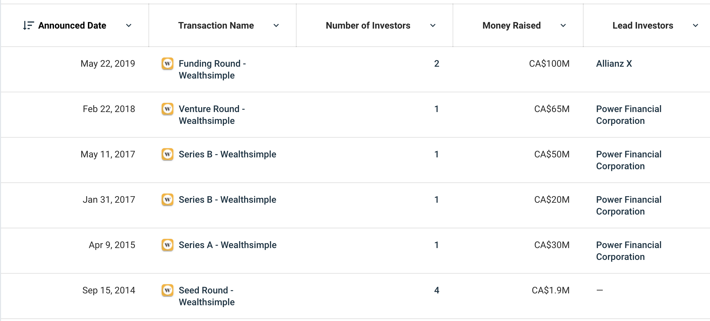

# Intro-to-Finance
This assignment studies WealthSimple from various perspectives as an exercise for exploring oneself to fintech industry.  

## Overview and Origin

__*Q: Name of company*__

A: WealthSimple

__*Q: When was the company incorporated?*__

A: Wealthsimple Inc. is a Canadian online investment management service was founded in September 2014 by Michael Katchen and is based in Toronto. 
Now WealthSimple is the [__largest__](https://www.moneysense.ca/save/investing/wealthsimple-review/) robo-advisor in Canada and has the highest count of assets under management ($4.3 billion), evidence of a large client base. [1]

__*Q: Who are the founders of the company?*__

 

A: WealthSimple was founded by [Michael Katchen](https://www.linkedin.com/in/mkatchen/?originalSubdomain=ca) in 2014.

__*Q: How did the idea for the company (or project) come about?*__

A: Prior to founding Wealthsimple, Michael Katchen worked for 1000Memories, a Silicon Valley-based startup. After Ancestry.com bought 1000Memories in 2012, Katchen developed a spreadsheet with tips to help his colleagues set up investment portfolios.  Michael has been interested in investing since 12 years old, and the acquision of 1000Memories helped him get enough money to try his investing ideas out. During an interview with [Omri Barzilay](https://www.forbes.com/sites/omribarzilay/#b55dd075ee9f), Michael talked about his early experience prior to launching WealthSimple:

> Before starting Wealthsimple, I worked at a YC-backed startup called 1000memories, and we sold the business to Ancestry.com in 2012. When that happened, the team I was working with came into a little money for the first time and wasn't sure what to do with it. I've been interested in investing since I was 12 and offered to help them build a simple portfolio, which I did one evening with a spreadsheet. Their feedback was, “This looks like a great plan, but can you just do it for me?” And they became Wealthsimple's first customers.

Interest in the spreadsheet helped inspire the idea for Wealthsimple and in 2014, he returned to Toronto to launch the company. [2]

__*Q: How is the company funded? How much funding have they received?*__

A: There have been six rounds of funding since 2015 and majority of funding comes from Power Financial. [3]

## Business Activities

__*Q: What specific financial problem is the company or project trying to solve?*__

A: Accessing financial advice and tools are used to be only possible with lots of money and as a consequence, many people, 
and younger forks in particular, were not being served by the traditional financial services industry.The company’s purpose is to make sure everyone has the ability to exercise financial freedom. It is making great investment advice accessible to everyone through technology and simplifying investing by making it human. [2]

__*Q: Who is the company's intended customer?  Is there any information about the market size of this set of customers?*__

A: __Millennials__ are the company’s target customers, WealthSimple provides financial services to every one of millennials, regardless of age or net worth. And with regard to thhe market size  of its clients, as of Q1 2019, Wealthsimple announced __$4.3 billion__ AUA with about __150,000 clients__. [4]

__*Q: What solution does this company offer that their competitors do not or cannot offer?*__

A: The key strategy that makes WealthSimple stand out from its competitors is that WealthhSimple developed a hybrid approach where they pair their [robo-advisors](https://www.wealthsimple.com/en-ca/learn/what-is-robo-advisor) with a team of financial experts who review the performance of portfolios. And the level of support is related to the client tiers.  Specifically, financial planning and goal setting is available to their Wealthsimple Generation tier, though they offer simple financial advice to their basic users. 

In addition, the aesthetic-forward app and website design also appealed to younger investors. [4]

__*Q: Which technologies are they currently using, and how are they implementing them?*__

A: WealthSimple leverages AI to automate processes to not only value-added services to high-net-worth clients but also construct inexpensive ETF portfolios for small clients that mirror their strategies for high-net-worth clients. In addition to [artificial intelligence](https://www.investopedia.com/terms/a/artificial-intelligence-ai.asp#:~:text=Artificial%20intelligence%20(AI)%20refers%20to,as%20learning%20and%20problem%2Dsolving.),  [distributed systems](https://blog.stackpath.com/distributed-system/), [latest web technologies](https://tms-outsource.com/blog/posts/web-technologies/) and state-of-the-art databases are also playing significant roles in WealthSimple technology land. Specifically, [Postgres/MySQL databases](https://blog.panoply.io/postgresql-vs.-mysql) are adopted, programming languages including Ruby, Node.js and Python are used to implement highly scalable applications. [5]

## Landscape

__*Q: What domain of the financial industry is the company in?*__

WealthSimple focuses on several financial fields: investment management, personal finance and trading. Specifically, [__Wealthsimple Invest__](https://www.wealthsimple.com/en-ca/product/invest/) is a robo-advisor that offers beginners or investors who prefer to be hands-off a choice of investment portfolios to suit their risk tolerance and financial goals. [__Wealthsimple Trade__](https://www.wealthsimple.com/en-ca/product/trade/) is a discount online brokerage, geared towards people who want to be hands-on with their investments. And [__Wealthsimple Cash__](https://www.wealthsimple.com/en-ca/product/cash/) is the newest addition—it’s a no-fee hybrid chequing and savings account.

__*Q: What have been the major trends and innovations of this domain over the last 5-10 years?*__

A: Artificial intelligence has been innovating investment management since the last decade and the robo-advisors powered by the fast-growing field of artificial intelligence (AI), which is able to process and interpret vast amounts of data at lightning speed, are eroding independent firms' market share and becomes more and more appealing to tech-savvy investors preferring the low-cost model and the mobile convenience that robos offer.

Initially offered by startups, robos are now part of the suite of services offered by major financial institutions such as *Vanguard*, *Schwab* and *Fidelity*. Since they are less expensive than a human advisor, they democratize access to financial advice.

Here are top 10 Robo-Advisors by Assets Under Management (in millions, as of June 30, 2019): [6]

 

As of 2019, robo-advisors are currently managing $5.4 billion of Canadians' money. That's expected to go up to $16.6 billion by 2023. The average amount invested across the robo-advisor industry is $19,838, but this is expected to grow as Canadians invest a higher percentage of their portfolios with a robo-advisor, or as their net worth grows.

__*Q: What are the other major companies in this domain?*__

Robo-advisors were first introduced in Canada in 2014. Since then, more and more have started in Canada, and until today there are 14 companies that provide automated services. [7]

There are four other main companies in wealth management field apart from WealthSimple:

| Company Name  | Company Description |
| ------------- | ------------- |
| [Nest Wealth](https://www.nestwealth.com/)  | A wealth management company that provides investors with a “smarter, quicker way to reach their financial goals.”  |
| [WealthBar](https://www.wealthbar.com/)  | A registered portfolio manager in all provinces in Canada and full life insurance agent in British Columbia and Ontario. The company describes itself as offering premium online investing without the premium price. It has over $275 million in assets under management.  |
| [Justwealth](https://www.justwealth.com/) | An online portfolio management platform that offers exchange-traded funds to meet a variety of investment goals and risk tolerances. They are a privately held corporation that was founded in 2015. |
| [ModernAdvisor](https://www.modernadvisor.ca/) | An online investment manager that offers passive investing options with low management fees. They are registered as a portfolio manager in every province in Canada, plus the Northwest Territories. |

## Results

__*Q: What has been the business impact of this company so far?*__

Fintech like WealthSimple has been changing business models in financial services, making financial advice, insurance and investment services more accessible to consumers and available to them by the means and at the times that best suit them.

__*Q: What are some of the core metrics that companies in this domain use to measure success? How is your company performing, based on these metrics?*__

Since investment management is one of the main services provided by WealthSimple, metrics used to measure investment performance are applicable to WealthSimple Invest. Some of  the main metrics are *portfolio expected return*, *portfolio volatility* and *money-weighted rate of return*. [8]

In terms of performance of WealthSimple Invest service, the following evidence shows that WealthSimple performed outstanding in multiple portfolios provided: [9]

| Invest Profolio  | Performance Review |
| ------------- | ------------- |
| [Growth Portfolio](https://help.wealthsimple.com/hc/en-ca/articles/214187018-How-has-the-Growth-portfolio-performed-) | The portfolio has grown by 35.4% (net of fees) since Wealthsimple's launch on August 20, 2014, to April 30, 2020. |
| [Balanced portfolio](https://help.wealthsimple.com/hc/en-ca/articles/214187188-How-has-the-Balanced-portfolio-performed-) | The portfolio has grown by 26.7% (net of fees) since Wealthsimple's launch on August 20, 2014, to April 30, 2020. |
| [Conservative portfolio](https://help.wealthsimple.com/hc/en-ca/articles/214880087-How-has-the-Conservative-portfolio-performed-) | The  portfolio has grown by 23.2% (net of fees) since Wealthsimple's launch on August 20, 2014, to April 30, 2020. |
| [Growth SRI portfolio](https://help.wealthsimple.com/hc/en-ca/articles/220391888-How-has-the-Growth-SRI-portfolio-performed-)  | The portfolio has grown by a cumulative 26.8% (net of fees) since it was launched on March 24, 2016 to April 30, 2020. |

__*Q: How is your company performing relative to competitors in the same domain?*__

WealthSimple is now one of the only multinational fintech firms in the world. It received back-to-back [Webby Awards](https://www.webbyawards.com/) as the Best Financial Services Website in the World in 2016 and 2017 and has __4 billion CAD__ under management. [10]

## Recommendations

__*Q: If you were to advise the company, what products or services would you suggest they offer?*__

An [__algorithmic trading system__](https://www.investopedia.com/articles/trading/11/automated-trading-systems.asp) can be launched for individuals to perform stock/ETF trading using quantitative algorithms so that investors can choose algorithms in their own will to automate their own algorithmic trading. 

__*Q: Why do you think that offering this product or service would benefit the company?*__

Providing such a platform would not only help the company to acquire talents but also expose   the company itself to a pool of various quantitative trading strategies. 

__*Q: What technologies would this additional product or service utilize?*__

[__High performance computing__](https://www.netapp.com/us/info/what-is-high-performance-computing.aspx) and machine learning should be utilized to build a smart and fast trading system. 

__*Q: Why are these technologies appropriate for your solution?*__

High performance computing technology helps build low-latency trading systems and machine learning helps the system to improve itself from past performance in terms of the operating performance and the accuracy as well as the degree of support for investors.[11]

## References

- [1]. https://www.moneysense.ca/save/investing/wealthsimple-review/
- [2]. https://www.forbes.com/sites/omribarzilay/2017/05/11/at-28-years-old-michael-katchen-raises-another-37m-in-new-series-b-funding/#300fd48c286c
- [3]. https://www.crunchbase.com/organization/wealthsimple#section-funding-rounds
- [4]. https://golden.com/wiki/Wealthsimple-8M4E58
- [5]. https://www.linkedin.com/jobs/view/1876750375/?refId=3155435151591369709872&trk=d_flagship3_company
- [6]. https://www.investopedia.com/robo-advisors-2019-where-have-all-the-assets-gone-4767826
- [7]. https://www.wealthsimple.com/en-ca/learn/best-robo-advisor#benefits_of_robo_investing_in_canada
- [8]. https://medium.com/fintechexplained/how-do-we-measure-investment-performance-7970042c6ae8
- [9]. https://help.wealthsimple.com/hc/en-ca/sections/115004099848-Performance
- [10]. https://doberman.co/work/wealthsimple/
- [11]. https://www.netapp.com/us/info/what-is-high-performance-computing.aspx

