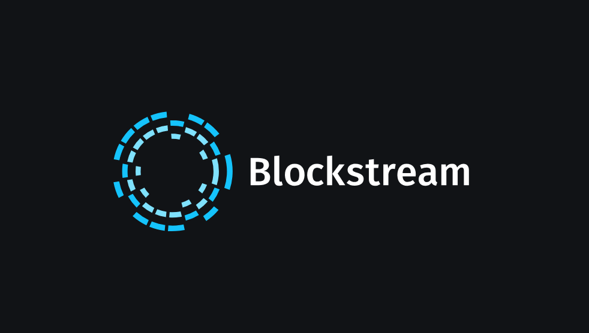

# Case Study Proposal: Blockstream

## What Is It

Blockstream is a blockchain technology company led by co-founder Dr. Adam Back, headquartered in Victoria, Canada, with offices and staff worldwide. The company develops a range of products and services for the storage and transfer of Bitcoin and other digital assets. Since it was founded in 2014, Blockstream has been the leading provider of blockchain technologies and has remained on the forefront of work in cryptography and distributed systems.Blockstream has historically been a contentious organization within the crypto community. Critics have asserted that Blockstream could be a threat to Bitcoin’s decentralized nature, while others have argued that it is necessary as it provides a source of funding for its bitcoin developers.

Blockstream offers several products including sidechain settlement network Liquid, bitcoin wallet Blockstream Green, a data feed for crypto trades, a Block Explorer, and Blockstream Satellite allowing access to the blockchain without internet. Out of the numerous products offered by Blockstream, here are the particular ones:

* Lightning Networks: Blockstream is collaborating with industry leaders to create a Bitcoin micropayment system that supports high volumes of instant tiny payments using proportional transaction fees and that operates at the speed of light.
* Liquid: Liquid provides a more secure and efficient system for exchange-side bitcoin to move across the network.
* Cryptocurrency Data Feed: The Cryptocurrency Data Feed, a partnership between Blockstream and Intercontinental Exchange (ICE), offers traders best in class real-time and historical cryptocurrency data from a strong and growing list of exchange partners worldwide.
* Blockstream Satellite: Utilizing the latest open source Software Defined Radio (SDR) technologies, the Blockstream Satellite network offers a breakthrough in the cost effectiveness of satellite communications.
* The Elements Project: The Elements Project is a community of people extending and improving the Bitcoin codebase. As open source, protocol-level technology, developers can use Elements to extend the functionality of Bitcoin and explore new applications of the blockchain.

## Why This Matters

Blockstream’s mission is to create the financial infrastructure of the future. Blockstream builds crypto-financial infrastructure based on Bitcoin, the most robust and secure blockchain. Applying cutting-edge cryptography and security engineering, blockstream is building the technology that makes financial markets more efficient by reducing reliance on trust. With a long-term outlook on delivering robust and scalable solutions, the company invests heavily in research and development to strengthen the Bitcoin ecosystem and protocol.

## Why This May be Interesting

Blockstream is pioneering advancements in cryptocurrencies and blockchains to support a broad range of applications and industries. Blockstream provides companies with the most mature, well tested, and secure blockchain technology in production – the Bitcoin protocol extended via interoperable sidechains – along with one of the most experienced teams in the industry. In addition, Blockstream opens finance to everyone, the company builds software that accelerates the adoption of Bitcoin and peer-to-peer finance for a fairer financial system that benefits everyone, not just a privileged few. With the help of blockchain technology, Blockstream is empowering individuals and businesses to take control of their own finances and reducing the need for trusted third parties.

## Things to Keep in Mind for Blockstream

* Blockstream is a provider of blockchain technologies, on the forefront of work in cryptography and distributed systems. 

* Blockstream promotes disruption to any financial operation that has low transparency and limited traceability impact of business activities.

* Blockstream missions to build a peer-to-peer, open-network finance.

* Blockstream provides a range of software and hardware solutions and expert professional services to companies deploying new blockchain-based networks.

## Resources

* [About Blockstream](https://blockstream.com/about/)

* [Blockstream Products](https://blockstream.com/)

* [Blockstream Crunchbase Metrics](https://www.crunchbase.com/organization/blockstream)

* [Blockstream Q&A On Sidechains](https://blogs.wsj.com/moneybeat/2014/11/17/bitbeat-blockstream-q-wedbush-invests-in-buttercoin/)

* [Blockstream makes its Bitcoin mining operations public](https://finance.yahoo.com/news/blockstream-makes-bitcoin-mining-operations-140013921.html)

---

