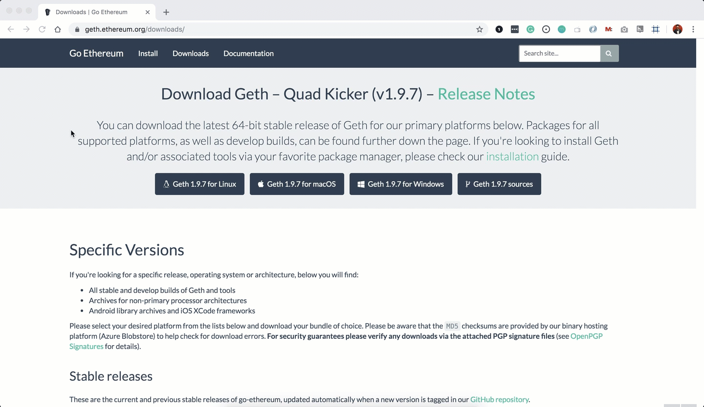
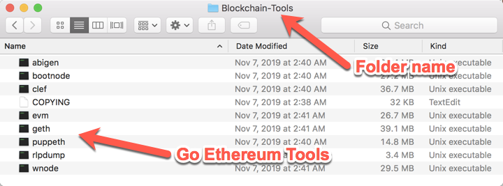
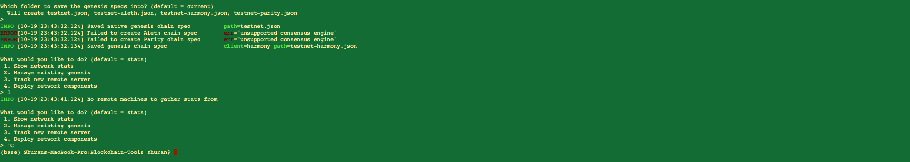
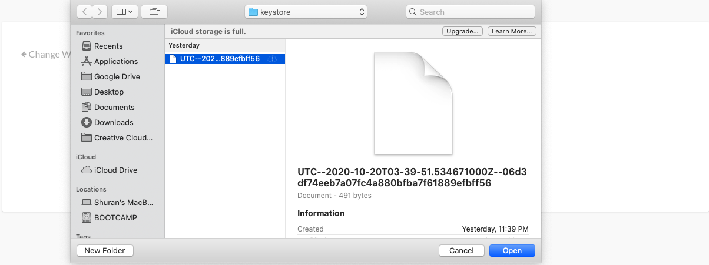
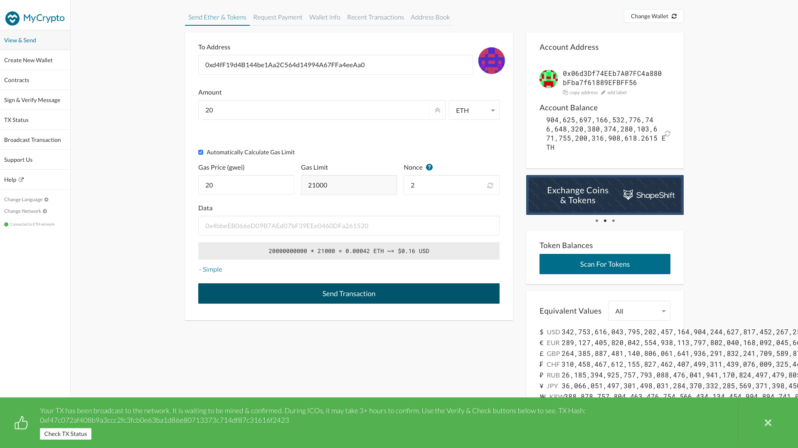
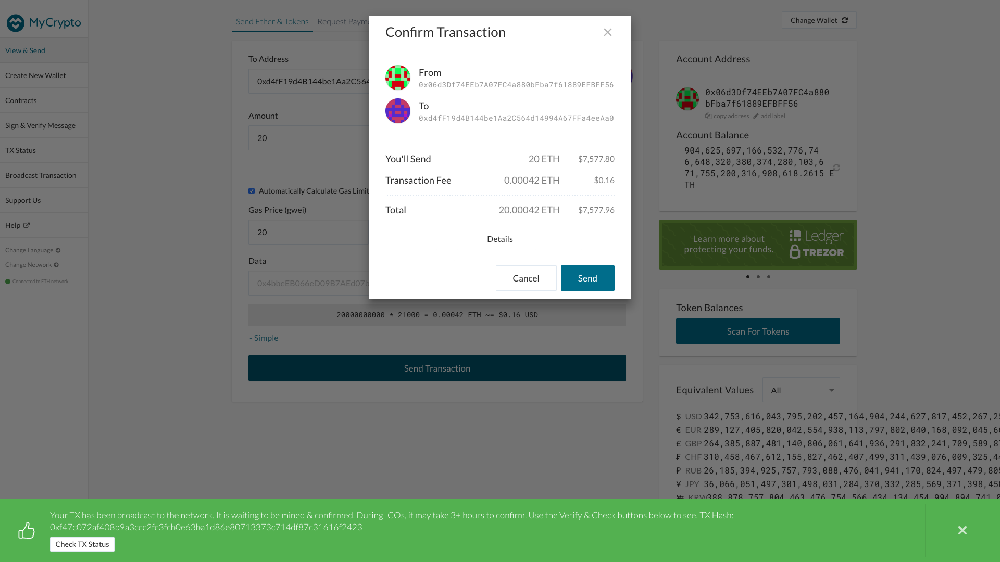
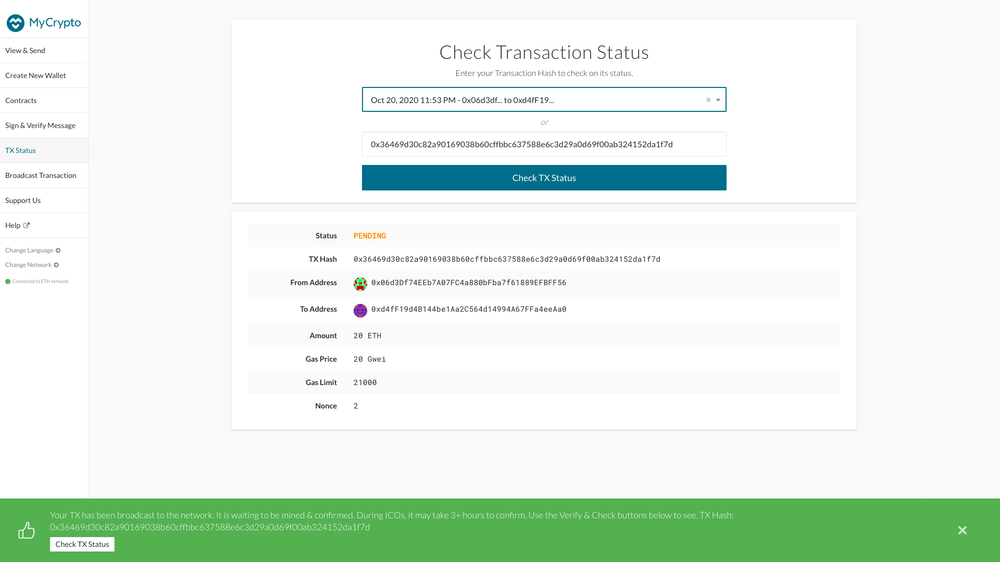

# blockchain-homework

## Environment Setup

### Installing Go Ethereum Tools

[Go Ethereum](https://geth.ethereum.org/) is one of the three original implementations of the Ethereum protocol. It is written in Go, fully open-source and licensed under the GNU LGPL v3.

In this Unit, we will use Go Ethereum Tools to create our very own blockchain, from the genesis block to mining tokens and making transactions.

Though there are installers for OS X and Windows, we will use the application executable binary files to have a seamless experience between both operating systems and to avoid some technical issues that currently exist in Windows.

To install the Go Ethereum Tools, please follow the next steps:

1. Open your browser and navigate to the Go Ethereum Tools download page at https://geth.ethereum.org/downloads/

2. Scroll down to the "Stable Releases" section and proceed depending on your operating system.

    * Installing on OS X: 
    Click on the **"Geth & Tools 1.9.7"** to download the applications bundle archive.
    

    * Installing on Windows:
        * *NOTE:* You need to know if you are running a `32 bit` or `64 bit` version of Microsoft Windows, if you are not sure about that, you can check your version following [these steps](https://support.microsoft.com/en-us/help/13443/windows-which-version-am-i-running)):

       * Depending on your Windows version, you should download the `32 bit` or `64 bit` version of the Go Ethereum Tools.
    
    

3. After downloading the tools archive, open your "Downloads" folder, and you will find a file named `geth-alltools-darwin-amd64-1.9.7-a718daa6.tar.gz` in OS X, and a file called `geth-alltools-windows-amd64-1.9.7-a718daa6.zip` in Windows. Note that the last numbers in the filename could vary depending on the last build available.

4. Decompress the archive in the location of your preference on your computer's hard drive, and rename the containing folder as `Blockchain-Tools`. We recommend using a location that can be easily accessed from the terminal window like the user's home directory.

 

---

### Generating Custom Genesis Block and Nodes

1. Create accounts for two nodes for the network with a separate `datadir` for each using `geth`.

    * `./geth --datadir node1 account new`
    * `./geth --datadir node2 account new`

2. Generate a Genesis Block with the following instructions:

    * Run `puppeth`, name `testnet`, and select the option to configure a new genesis block.

    * Choose the `Clique (Proof of Authority)` consensus algorithm.

    * Paste both account addresses from the first step one at a time into the list of accounts to seal.

    * Paste them again in the list of accounts to pre-fund. There are no block rewards in PoA, so you'll need to pre-fund.

    * You can choose `no` for pre-funding the pre-compiled accounts (0x1 .. 0xff) with wei. This keeps the genesis cleaner.

    * Complete the rest of the prompts, and when you are back at the main menu, choose the "Manage existing genesis" option.

    * Export genesis configurations. This will fail to create two of the files, but you only need `testnet.json`.

    
    

3. Explanation of the Network Configuration

    * Blocktime: 15 mins, which is the default block time.
    * Chain ID: 334
    * Account passwords:
        * node 1:  `1234`
        * node 2: `1234`
    * Node ports:
        * node 1: `30303`
        * node 2: `30304`
    * Network ports: `8545`
    * Consensus Algorithm: `Clique (Proof of Authority)`

---

### Activate the Genesis Network 

1. Using `geth`, initialize each node with the new `testnet.json`.
    * `./geth --datadir node1 init testnet.json`
    * `./geth --datadir node2 init testnet.json`

    __Note__:  `--datadir` specifies the data directory for the target node, and `init` indicates that the node is to be initialized using `testnet.json`

2. Copy and save the public address and secret key file. In this case:
    * Node 1 Public Address: `0xd4fF19d4B144be1Aa2C564d14994A67FFa4eeAa0`
    * Node 1 Path of the secret key file: `node1/keystore/UTC--2020-10-20T03-38-49.739630000Z--d4ff19d4b144be1aa2c564d14994a67ffa4eeaa0`
    * Node 2 Public Address: `0x06d3Df74EEb7A07FC4a880bFba7f61889EFBFF56`
    * Node 2 Path of the secret key file: `node2/keystore/UTC--2020-10-20T03-39-51.534671000Z--06d3df74eeb7a07fc4a880bfba7f61889efbff56`

3. Run the nodes in separate terminal windows as follows:
    *  `./geth --datadir node1 --unlock "0xd4fF19d4B144be1Aa2C564d14994A67FFa4eeAa0" --mine --rpc --allow-insecure-unlock`

    __Note__: The above command essentialy unlocks account for node1, enables mining and enables the HTTP-RPC server so that applications like `MyCrypto` would be able to connect to the network.
    `--unlock value` specifies a comma separated list of accounts to unlock, `--mine` enables mining, `--rpc` enables the HTTP-RPC server and `--allow-insecure-unlock` allows insecure account unlocking when account-related RPCs are exposed by http.

    * Save enode address for node 1, in this case is `enode://ed81d17e96366af13de8b274857fa84081ab50b6392600002c72a99ddeb7f82181ce145ccf262f93ff9862d9ba882d9773811857aa12452b70ea37a8810309dd@127.0.0.1:30303`
    *  `./geth --datadir node2 --unlock "0x06d3Df74EEb7A07FC4a880bFba7f61889EFBFF56" --mine --port 30304 --bootnodes "enode://ed81d17e96366af13de8b274857fa84081ab50b6392600002c72a99ddeb7f82181ce145ccf262f93ff9862d9ba882d9773811857aa12452b70ea37a8810309dd@127.0.0.1:30303" --ipcdisable --allow-insecure-unlock`

    __Note__: `--port` option specifies a network listening port (default: 30303), `--bootnodes` indicates a comma separated enode URLs for P2P discovery bootstrap and `--ipcdisable` basically disables the IPC-RPC server for node2.

    * Save enode address for node 2, in this case is `enode://14a1b6892565fb2be34a538061e5e1a862c769aa9d8bc070d72808c49c1b21e5b2bc275cc50d3f0800f4dd88b0bd493d6c486778b8a4139144a5041d6b8c448a@127.0.0.1:30304`

At this point the private PoA blockchain should now be running.

---

### Connecting MyCrypto to the blockchain

* Open the MyCrypto app, then click `Change Network` at the bottom left:

    

    * Click "Add Custom Node", then add the custom network information that you set in the genesis.

    * Make sure that you scroll down to choose `Custom` in the "Network" column to reveal more options like `Chain ID`:

    

    * Type `ETH` in the Currency box.
    
    * In the Chain ID box, type the chain id you generated during genesis creation.

    * In the URL box type: `http://127.0.0.1:8545`.  This points to the default RPC port on your local machine.

    * Finally, click `Save & Use Custom Node`. 

    __Note__: Please change `Chain ID` to `334`, Network Name to `testnet` !

---

### Transactions between nodes 
    
1. Select the `View & Send` option from the left menu pane, then click `Keystore file`.

    

2. On the next screen, click `Select Wallet File`, then navigate to the keystore directory inside your Node1 directory, select the file located there, provide your password when prompted and then click `Unlock`.
    
    
    
    

    * In the `To Address` box, type the account address from Node1, then fill in an arbitrary amount of ETH:

     
     
    * Confirm the transaction by clicking "Send Transaction", and the "Send" button in the pop-up window.  
    

    * Click the `Check TX Status` when the green message pops up, confirm the logout:

    

3. Description of Transaction Status Abnormality

   The transaction fails to be succeed. Instead, the transaction status has been `pending` ever since.

    

    I have tried to terminate both nodes, closed `MyCrypto`, a fer minutes later activated both nodes again and relaunched `MyCrypto`. However, the transaction status never changed. I tried 4 times but none of them worked. 
    Forturnately, from this assignment I learnt how to build a customized Genesis Network, how to create network nodes and enable them to do mining and blockchain polling in the custom Genesis Network. The practice of sending transactions among nodes via `MyCrypto` enabled me to have a better understanding of transactions in a Genesis network running the cutting-edge concensus algorithm. 

