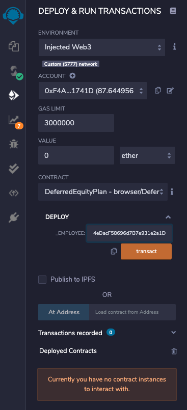

# FinTech Assignment 20

## AssociateProfitSplitter on local ether test net

AssociateProfitSplitter contract accepts ether into the contract, and divide it evenly among associate-level employees. This will allow the human resources department to pay employees quickly and efficiently.

Addresses `0x31DF33B2031198e05E4Dd6BA47C70913Be053ca2`, `0xeEC895DfbC492cf34eDacF58696d7B7e931e2a1D`  and `0xdcBb8E08e93fD1442039eD65C381666D495d75Be` are used to register the AssociateProfitSplitter contract:

The original balances for these addresses prior to the transaction are shown as follows:

We sent `10 ether` to the contract and deposit it to these three addresses:

Upon the transaction, each account will have `3 ether` evenly:

The transaction is verified by the `balance` field:

---

## TieredProfitSplitter on local ether test net

TieredProfitSplitter contract is used to distribute different percentages of incoming ether to employees at different tiers/levels. For example, the CEO gets paid 60%, CTO 25%, and Bob gets 15%. This contract ensures 
each employee earns fair amount of compensation based on their contribution to the company.

Addresses `0x31DF33B2031198e05E4Dd6BA47C70913Be053ca2`, `0xeEC895DfbC492cf34eDacF58696d7B7e931e2a1D`  and `0xdcBb8E08e93fD1442039eD65C381666D495d75Be` are used to register the TieredProfitSplitter contract:

The original balances for these addresses prior to the transaction are shown as follows:

We sent `10 ether` to the contract and deposit it to these three addresses:

Upon the transaction, each account will have different amounts of ether, with `0x31DF33B2031198e05E4Dd6BA47C70913Be053ca2` getting `6 ether`, `0xeEC895DfbC492cf34eDacF58696d7B7e931e2a1D` getting `2.5 ether` and
`0xdcBb8E08e93fD1442039eD65C381666D495d75Be` getting `1.5 ether`:

The transaction is verified by the `balance` field:

---

## DeferredEquityPlan on local ether test net

DeferredEquityPlan contract models traditional company stock plans, it automatically manages 1000 shares, with an annual distribution of 250 shares over four years for a single employee. The intention is to motivate
employees to stay and contribute to the company.

address `0xeEC895DfbC492cf34eDacF58696d7B7e931e2a1D` is used to deploy the contract:

Since the time lock is 365 days, distributing shares at the beginning of the employment or less than a year will not exceed:

Provided that `fast_forward( )` is implemented and applied, we can click `fastforward` button to simulate time-passing. Fast forwarding is initiated as a transaction of `0 ether`:

Upon 4 times of fast forwarding, we are able to distribute the first 250 shares, and this sets the `distributed shares` to `250`:

Suppose we continue doing fast forward for the next 3 years, we will accumulate the distributed shares annually with 250 shares:

---

## AssociateProfitSplitter on the Kovan net

Now we deploy a `AssociateProfitSplitter` contract at the Kovan net and continue using addresses `0x31DF33B2031198e05E4Dd6BA47C70913Be053ca2`, `0xeEC895DfbC492cf34eDacF58696d7B7e931e2a1D`  and `0xdcBb8E08e93fD1442039eD65C381666D495d75Be` to register the AssociateProfitSplitter contract. The original balances for these addresses prior to the transaction are shown as follows:

The original balance for account `0x31DF33B2031198e05E4Dd6BA47C70913Be053ca2`:

The original balance for account `0xeEC895DfbC492cf34eDacF58696d7B7e931e2a1D`:

The original balance for account `0xdcBb8E08e93fD1442039eD65C381666D495d75Be`:

We sent `0.3 ether` to the contract and deposit it to these three addresses:

Upon the transaction, each account will have `3 ether` evenly:

The new balance for account `0x31DF33B2031198e05E4Dd6BA47C70913Be053ca2`:

The new balance for account `0xeEC895DfbC492cf34eDacF58696d7B7e931e2a1D`:

The new balance for account `0xdcBb8E08e93fD1442039eD65C381666D495d75Be`:

The transaction is verified by the `balance` field:

---

## TieredProfitSplitter on the Kovan net

Now we deploy a `TieredProfitSplitter` contract at the Kovan net and continue using addresses `0x31DF33B2031198e05E4Dd6BA47C70913Be053ca2`, `0xeEC895DfbC492cf34eDacF58696d7B7e931e2a1D`  and `0xdcBb8E08e93fD1442039eD65C381666D495d75Be` to register the AssociateProfitSplitter contract. Note that the original balances for these addresses prior to the transaction all start with `0.2 ether`.

We sent `0.2 ether` to the contract and deposit it to these three addresses:

Upon the transaction, each account will have `3 ether` evenly:

The new balance for account `0x31DF33B2031198e05E4Dd6BA47C70913Be053ca2`:

The new balance for account `0xeEC895DfbC492cf34eDacF58696d7B7e931e2a1D`:

The new balance for account `0xdcBb8E08e93fD1442039eD65C381666D495d75Be`:

---

## DeferredEquityPlan on the Kovan net

Now we deploy a `DeferredEquityPlan` contract at the Kovan net and continue using address `0xeEC895DfbC492cf34eDacF58696d7B7e931e2a1D` is used to deploy the contract. Since we need to wait for `365 days` 
to see the changes, I continue using `fakenow` to test on the Kovan net. Upon clicking `fastforward` button 4 times 250 shares was able to be distributed to the participated account and the distributed shares
was able to reflect the distribution.

Fast Forwarding is achieved by initiating the transaction via `MetaMask` with `0 ether`:

After the first year, which is simulated by pressing `fastforward` button four times, `distributed shares` increased to `250`:

__Note__: 

1. Due to limit of available `ether` amount, I was not able to fast forwarding the next three years as I couldn't afford the gas. However, 
I believe one should understand both the concept and the evidence of the working contract by now.  
2. To send ether, please send to `0x31DF33B2031198e05E4Dd6BA47C70913Be053ca2` and verify from `etherscan`.

