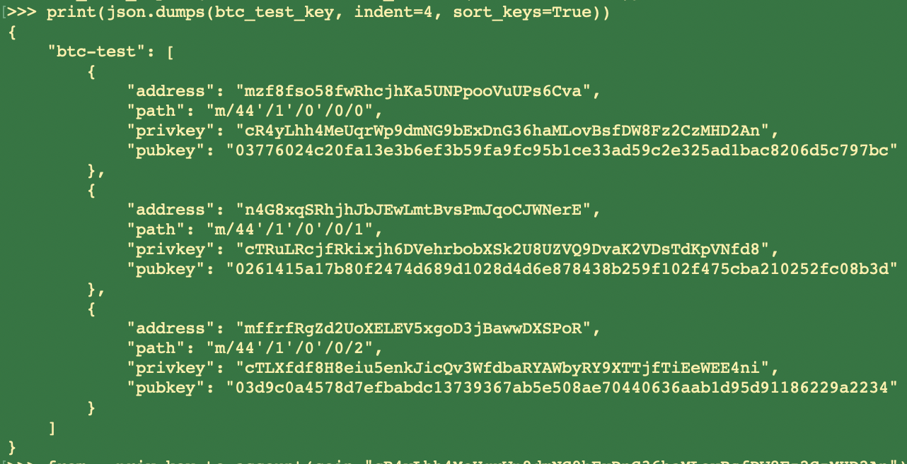
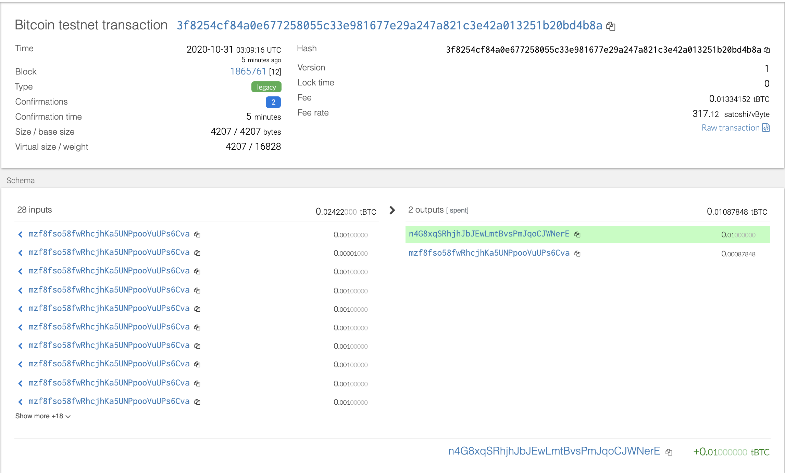
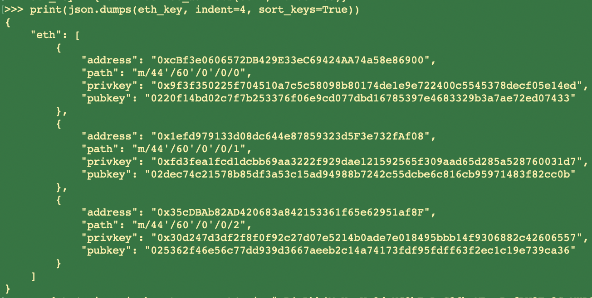
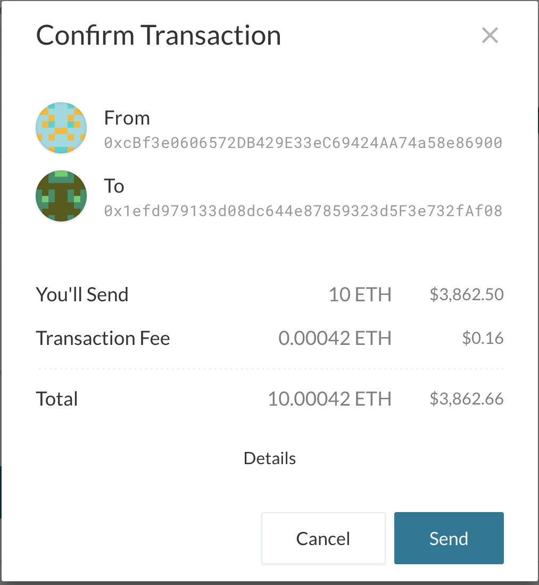
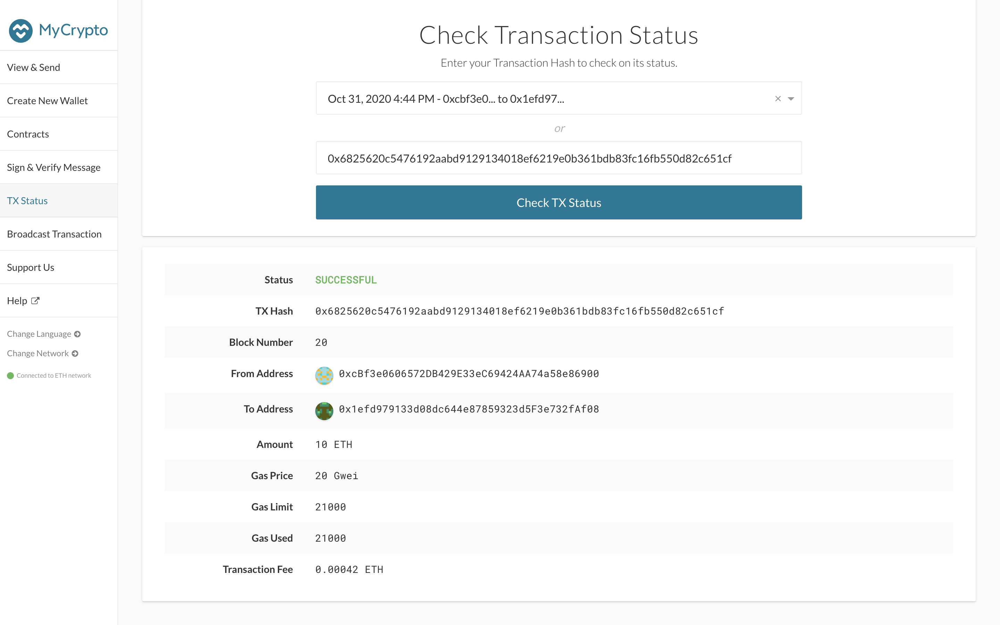
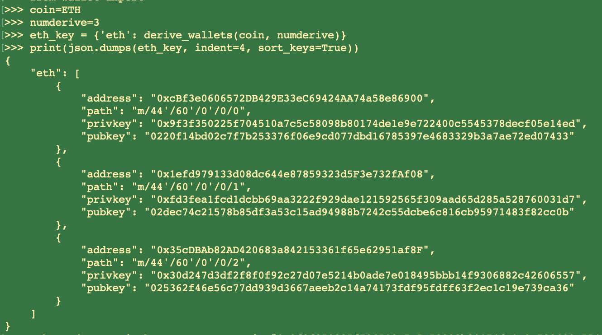
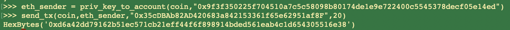

# Multi-Blockchain Wallet Assignment in Python

## Bitcoin Testnet transaction

The `btc-test` dictionary contains three accounts:

The code snippet that sends `BTC` from the account with address `mzf8fso58fwRhcjhKa5UNPpooVuUPs6Cva` to address `n4G8xqSRhjhJbJEwLmtBvsPmJqoCJWNerE` is as follows:

The transaction screenshot:

## Local PoA Ethereum transaction

The `eth` dictionary contains three accounts:

The account that is prefunded the ETH account with address `0xcBf3e0606572DB429E33eC69424AA74a58e86900`,  the account transfers  `10 ETH` to the ETH account with address `0x1efd979133d08dc644e87859323d5F3e732fAf08`:

The transaction status is:

Upon transaction completion on `MyCrypto`, sending `ETH` via `send_tx()` is also working correctly. Here the ETH account with address `0xcBf3e0606572DB429E33eC69424AA74a58e86900` is sending 1`ETH` to the account with address `0x1efd979133d08dc644e87859323d5F3e732fAf08`:

##  Wallet Description

In general, this wallet allows users to derive multiple accounts using the given mnemonic phase and deliver transactiions, for both `BTC` and `ETH`. More specifically, It provides the following features:

* create row transactions for both `ETH` and `BTC`
* send transactions for both `ETH` and `BTC`
* derive variant number of wallets from the given mnemonic phase

To use the wallet, users need to first specify the `coin` and `numderive`, and then obtain the derived wallets via `derive_wallets(coin, numderive)`. For instance, to derive 3 wallets for `ETH`, we can do the following:

To deliver transactions, user needs to first create a sender account object via `priv_key_to_account(coin, priv_key)` and then initate the transaction via `send_tx(coin, account, to, amount)`. For instance, to send 20 `ETH` to account with address `0x35cDBAb82AD420683a842153361f65e62951af8F` from account with private key `0x9f3f350225f704510a7c5c58098b80174de1e9e722400c5545378decf05e14ed`, do the following:

