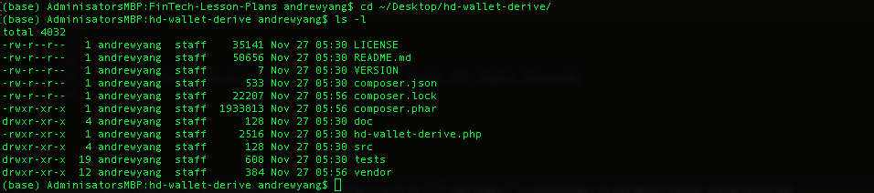

1. Installing web3 and bit using pip 

1). Use the pip install command to download and install the web3.py module.

`pip install web3`


2). Use the pip install command to download and install the bit module.

`pip install bit`


3). Verify installation of both modules

`pip list | grep web3`

`pip list | grep bit` 

2. hd-wallet-derive installation

* Navigate to the [Github website](https://github.com/dan-da/hd-wallet-derive) for the `hd-wallet-derive` library and scroll down to the installation instructions.

 

* Next, open a terminal and execute the following commands. If you are using Windows, you will need to open the `git-bash` GUI via `C:\Program Files\Git\bin\bash.exe` directly to enable something called `tty` mode that makes the terminal more compatible with Unix systems. Once installed, you may move back to using the usual `git-bash` terminal.

> **Warning**: When cloning the project be conscious of what folder you are cloning the files into. It would probably be best to clone it into your `Blockchain-Tools` folder.

 ```shell
 git clone https://github.com/dan-da/hd-wallet-derive
 cd hd-wallet-derive
 php -r "readfile('https://getcomposer.org/installer');" | php
 php -d pcre.jit=0 composer.phar install
 ```

* You should now have a folder called `hd-wallet-derive` containing the PHP library.

## hd-wallet-derive Execution

Last step! Execute the `hd-wallet-derive` library to derive `BIP32` addresses and private keys for Bitcoin and other alternative coins.

* Navigate to your `hd-wallet-derive` folder.

 

* Then execute the following commands (these are examples from the GitHub website).

 ```shell
 ./hd-wallet-derive.php -g --key=xprv9tyUQV64JT5qs3RSTJkXCWKMyUgoQp7F3hA1xzG6ZGu6u6Q9VMNjGr67Lctvy5P8oyaYAL9CAWrUE9i6GoNMKUga5biW6Hx4tws2six3b9c
 ```

 ```shell
 ./hd-wallet-derive.php -g --key=xprv9tyUQV64JT5qs3RSTJkXCWKMyUgoQp7F3hA1xzG6ZGu6u6Q9VMNjGr67Lctvy5P8oyaYAL9CAWrUE9i6GoNMKUga5biW6Hx4tws2six3b9c --numderive=3 --preset=bitcoincore --cols=path,address --path-change
 ```

 

